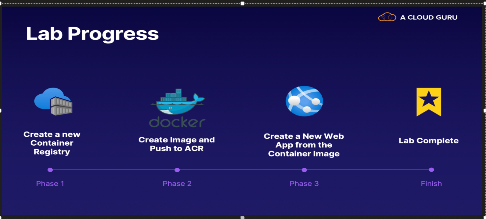
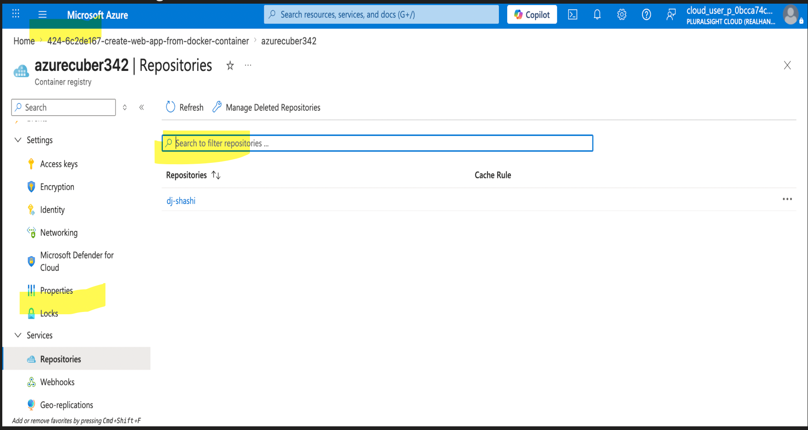
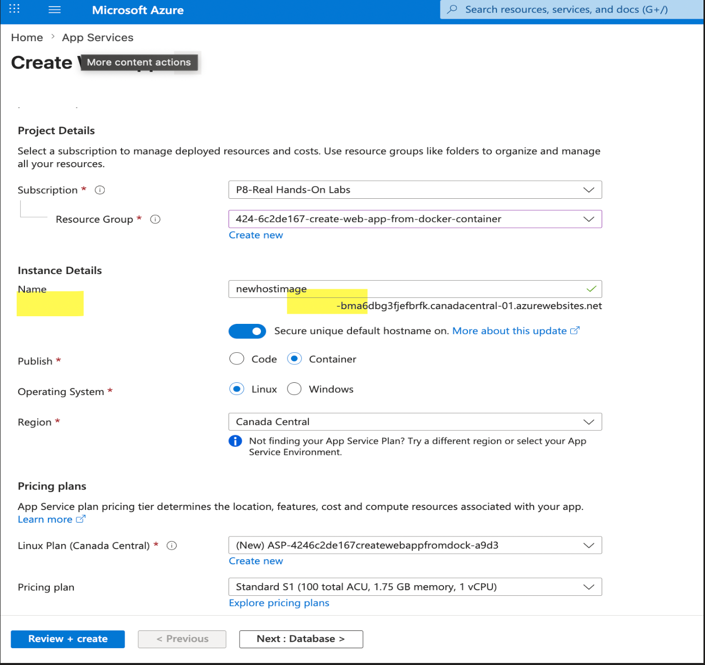
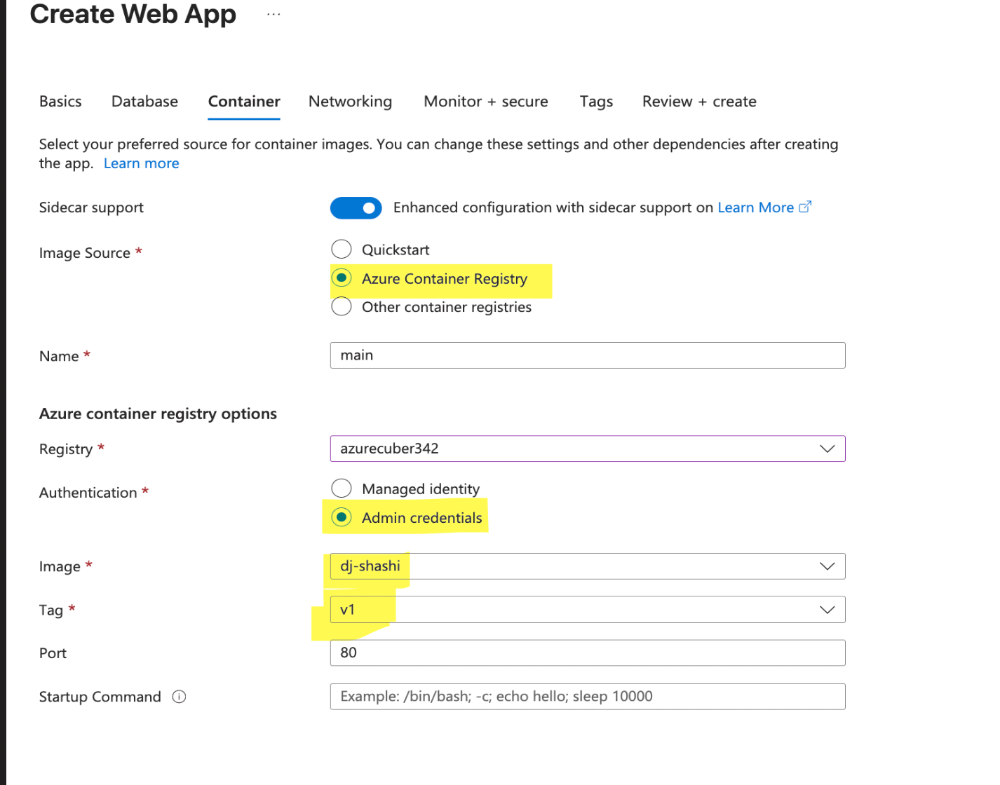
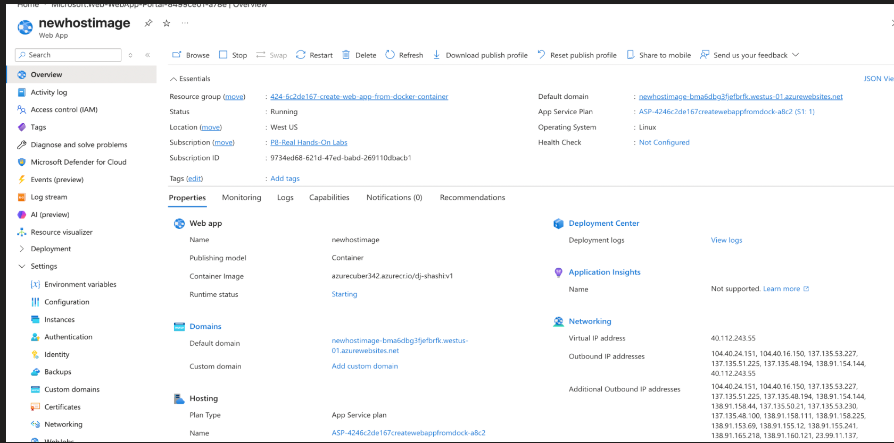
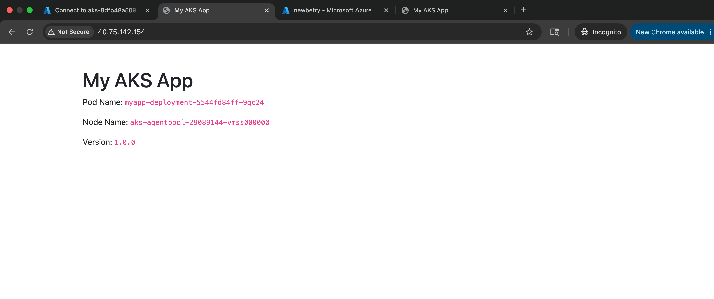

# az_204
Azure Container Registery , AKS , Azure Container Instance .

Create Web App from Docker Container in Azure

Lab Diagram 

Scenario for the lab.

GitHub URL where the DockerFile is present 
https://github.com/ACloudGuru-Resources/content-AZ-104-Microsoft-Azure-Administrator/tree/js-docker

Create a New Container Registry

az acr create --resource-group $RG --name $ACR --sku Basic --admin-enabled true

Build an Image and Push to ACR

git clone --branch js-docker https://github.com/ACloudGuru-Resources/content-AZ-104-Microsoft-Azure-Administrator.git ./js-docker

cd js-docker/

Build and push the image to Azure Container Registry using ACR Tasks and the Dockerfile provided (<IMAGE_NAME> can be anything you like e.g. js-docker:v1):

az acr build --image dj-shashi:v1 --registry $ACR --file Dockerfile .

As we can see the image is created In the ACR.

From here we can deployed this image in the web app , Azure container image , AKS cluster.

Create and Deploy a New Web App

-> while creating the web to host the image select container in the publish options.

In the container setting select this options.

We app overview page created with container.

The Web app Url is working.

==========================================================================================

Deploy Applications to Azure Kubernetes Service (AKS)

In this lab, you will be using an existing Azure Kubernetes Service (AKS) managed cluster.
You will learn how to easily create a containerized application, push it to a container registry attached to the AKS cluster, and deploy the application to the cluster.
For this lab, you should have a basic understanding of Containers and Kubernetes.

Clone the file from the git.

git clone https://github.com/pluralsight-cloud/aks-deploy-applications-lab.git

Cd myapp /

Now create the image with the docker file in the Azure container Registry(ACR)

DockerFile contain 

 

Build the image using the dockerfile CMD :

-> Store the name of the ACR 

ACR=$(az acr list --query [].name --output tsv)

	Ø Build CMD
 
az acr build --image $ACR/myapp:latest --registry $ACR .

Deploy Your Application to the Cluster

Set the AKS 

az aks get-credentials --resource-group 1068-82083c82-deploy-applications-to-azure-kuberne --name aks-8dfb48a509 --overwrite-existing

Now run the myapp-deployent.yaml file to create the pod.

-> Code myapp-deployment.yaml

 - > create the pod using the yaml file 

kubectl apply -f myapp-deployment.yaml

	Ø Rollout cmd 

kubectl rollout status deployment/myapp-deployment

	Ø Review the Kubernetes Service manifest to expose your application using a Azure Load Balancer, by running the following command:

kubectl apply -f myapp-service.yaml

	Ø Check the details of the pod 

kubectl get service myapp-service

Public IP : 40.75.172.157 

Output 

URL http://40.75.142.154/

Workload Deployment 

Yaml file to create the Pod is running.

apiVersion: apps/v1
kind: Deployment
metadata:
  name: myapp-deployment
  labels:
    app: myapp-deployment
spec:
  replicas: 1
  selector:
    matchLabels:
      app: myapp
  template:
    metadata:
      labels:
        app: myapp
    spec:
      containers:
      - name: myapp
        image: acr8dfb48a509.azurecr.io/acr8dfb48a509/myapp:latest
        ports:
        - containerPort: 80
        env:
            - name: NODE_NAME
              valueFrom:
                fieldRef:
                  fieldPath: spec.nodeName
            - name: POD_NAME
              valueFrom:
                fieldRef:
                  fieldPath: metadata.name

What happens after kubectl apply?

kubectl apply -f deployment.yaml
            │
            ▼
API Server validates the YAML
            │
            ▼
Stores the Deployment in etcd
            │
            ▼
Deployment created
            │
            ▼
Deployment creates a ReplicaSet
            │
            ▼
ReplicaSet creates 1 Pod (replicas: 1)
            │
            ▼
Scheduler assigns the Pod to a worker node
            │
            ▼
kubelet starts the container
            │
            ▼
Container runtime pulls the image from ACR
            │
            ▼
Application starts on port 80
            │
            ▼
Pod status becomes Running

